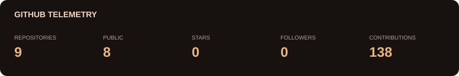
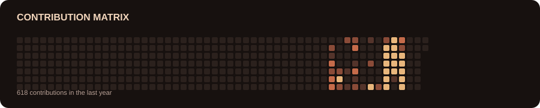

<h1>Sahilpreet Singh</h1>

Student and self-taught engineer exploring simulation, AI, physics, and hardware.

  
  

Based in Punjab, India

## About me

I am drawn to the part beneath the surface: the physics behind a simulation, the math behind an algorithm, and the engineering that makes an idea work outside of a screen. This is where I share the projects I am building as I learn - from first model to experiment, data, and improvement.

> **Build to understand. Test against reality. Improve what survives.**

## What I am focused on

<table>
<tr>
<td width="25%" valign="top">
<h3>Simulation</h3>
Orbital mechanics, numerical methods, and trajectory optimization for systems without clean answers.
</td>
<td width="25%" valign="top">
<h3>AI / ML</h3>
Optimization and learning agents - understanding the math, not only the API.
</td>
<td width="25%" valign="top">
<h3>Physics & Math</h3>
Dynamics, calculus, and probability applied to problems worth modelling.
</td>
<td width="25%" valign="top">
<h3>Hardware</h3>
Embedded systems and sensors that force a model to meet the real world.
</td>
</tr>
</table>

## Building now

<table>
<tr>
<td width="50%" valign="top">
<h3>JARVIS</h3>

A goal-based Windows computer-use agent that learns an application's interface while working and verifies its own outcomes.

</td>
<td width="50%" valign="top">
<h3>Earth-Moon Optimization</h3>

Turning an orbital simulation into a search across fuel use, transfer time, and lunar insertion over thousands of trials.

</td>
</tr>
</table>

## Selected projects

<table>
<tr>
<td width="50%" valign="top">
<h3>Earth-Moon Orbital</h3>

Monte Carlo rocket trajectories with orbital dynamics, atmospheric drag, lunar gravity, and live 2D visualization.

  
<a href="https://github.com/Sahilpreetsinghvirdi/Earth-Moon-Orbital"><b>View repository</b></a>
</td>
<td width="50%" valign="top">
<h3>AI NPC Simulation</h3>

C++20 agents learning through PPO, actor-critic methods, GAE, trajectory buffers, and persistent checkpoints.

  
<a href="https://github.com/Sahilpreetsinghvirdi/AI-NPC-simulation-with-finite-state-machine-architecture"><b>View repository</b></a>
</td>
</tr>
<tr>
<td width="50%" valign="top">
<h3>Black Hole - MATLAB</h3>

Numerical modelling and visualization of black-hole physics - a testbed for dynamics and mathematical intuition.

  
<a href="https://github.com/Sahilpreetsinghvirdi/Black-hole-Matlab"><b>View repository</b></a>
</td>
<td width="50%" valign="top">
<h3>4WD Autonomous Car</h3>

Sensor-driven navigation with ultrasonic sensing, motor control, and obstacle avoidance on real hardware.

  
<a href="https://github.com/Sahilpreetsinghvirdi/4WD-Automatic-Car"><b>View repository</b></a>
</td>
</tr>
</table>

<b>Also built: Stock Exchange</b>

 

A full-stack virtual market with live simulation, trading logic, portfolio tracking, and a leaderboard. The interesting part is keeping shared state consistent while activity is happening at the same time.

 
 

<a href="https://github.com/Sahilpreetsinghvirdi/Stock-Exchange"><b>View repository</b></a>

## Tools I work with

 
 

## GitHub activity

 

 

<i>Model it. Simulate it. Build it. See if it survives contact with reality.</i>

