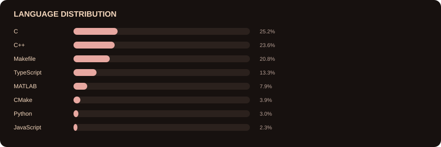
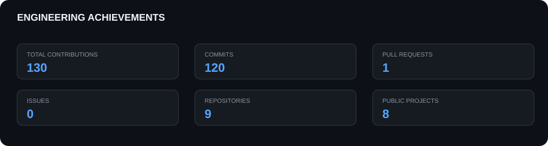

<div align="center">

# SAHILPREET SINGH

### SOFTWARE · AI · PHYSICS · SIMULATION · ROBOTICS


</div>

---

## // SYSTEM PROFILE

**I build computational and physical systems to learn how they work.**

My interests sit at the intersection of **software engineering, mathematics, physics, artificial intelligence, and electronics**. I like projects where the code has something underneath it: a model, an equation, a simulation, a physical system, or an optimization problem.

<table>
<tr>
<td width="50%" valign="top">

### CURRENT DIRECTION

- Numerical and physical simulation
- Orbital mechanics and trajectory optimization
- C++ systems and AI simulation
- Reinforcement learning
- Robotics and embedded systems
- MATLAB computational experiments

</td>
<td width="50%" valign="top">

### CORE STACK

`C++20` · `C` · `Python` · `MATLAB`  
`CMake` · `Git` · `Arduino` · `SolidWorks`

**Focus:** simulation · optimization · AI/ML · engineering

</td>
</tr>
</table>

---

## // ACTIVE PROJECTS

<table>
<tr>
<td width="50%" valign="top">

### 🚀 Earth → Moon Orbital

2D Earth–Moon rocket trajectory simulation using Monte Carlo trials, numerical orbital dynamics, atmospheric drag, lunar gravity and live trajectory visualization.

**MATLAB · Orbital Mechanics · Optimization**

[→ Repository](https://github.com/Sahilpreetsinghvirdi/Earth-Moon-Orbital)

</td>
<td width="50%" valign="top">

### 🧠 AI NPC Simulation

C++ simulation work exploring intelligent NPC behaviour, state machines, reinforcement-learning infrastructure, neural policies and persistent learning.

**C++20 · RL · PPO · Simulation**

[→ Repository](https://github.com/Sahilpreetsinghvirdi/AI-NPC-simulation-with-finite-state-machine-architecture)

</td>
</tr>
<tr>
<td width="50%" valign="top">

### 🌌 Black Hole — MATLAB

Computational visualisation and numerical modelling around black-hole physics.

**MATLAB · Physics · Numerical Simulation**

[→ Repository](https://github.com/Sahilpreetsinghvirdi/Black-hole-Matlab)

</td>
<td width="50%" valign="top">

### 🤖 4WD Autonomous Car

Sensor-driven autonomous vehicle work combining embedded programming, motors, sensors and navigation logic.

**Arduino · Electronics · Robotics**

[→ Repository](https://github.com/Sahilpreetsinghvirdi/4WD-Automatic-Car)

</td>
</tr>
</table>

---

## // GITHUB TELEMETRY

<div align="center">

</div>

## // LANGUAGE DISTRIBUTION

<div align="center">

</div>

## // CONTRIBUTION MATRIX

<div align="center">

</div>

## // ENGINEERING ACHIEVEMENTS

<div align="center">

</div>

---

## // SELECTED WORK

**Earth–Moon Orbital**  ·  **Monte Carlo Rocket Simulation**  ·  **AI NPC Simulation**  ·  **Black Hole MATLAB**  ·  **Stock Exchange**  ·  **4WD Autonomous Car**

[Browse all repositories →](https://github.com/Sahilpreetsinghvirdi?tab=repositories)

---

## // CONTRIBUTION SNAKE

<div align="center">

</div>

---

## // ENGINEERING PATH

```text
MATHEMATICS
     │
     ├── Numerical Methods
     │
     ▼
PHYSICS ────────────────┐
     │                  │
     ▼                  ▼
SIMULATION          OPTIMIZATION
     │                  │
     └────────┬─────────┘
              ▼
       INTELLIGENT SYSTEMS
              │
              ▼
        AI / MACHINE LEARNING
              │
              ▼
      REAL-WORLD ENGINEERING
```

---

<div align="center">

### `SYSTEM STATUS: BUILDING`

**Build · Simulate · Measure · Optimize**

<br/>

*Earn from what I know. Build from what I earn.*

</div>
